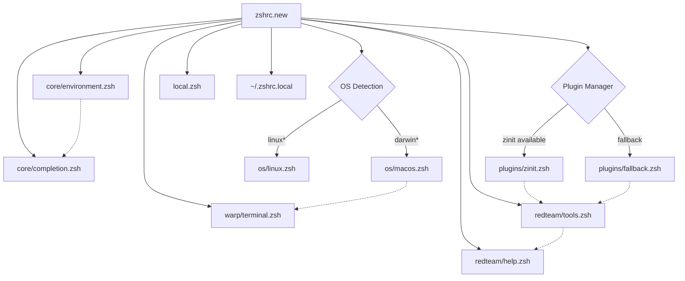

# Red Team Dotfiles Architecture

## Overview

This document describes the modular architecture of the Red Team Dotfiles system, designed for maintainability, security, and cross-platform compatibility.

## Architecture Principles

### 1. Modular Design
- **Separation of Concerns**: Each module handles a specific aspect of shell configuration
- **Lazy Loading**: Components are loaded only when needed for performance
- **Platform Agnostic**: Core functionality works across macOS, Linux, and WSL

### 2. Security-First Approach
- **OPSEC Compliance**: Built-in protection against data leakage
- **Environment Isolation**: Support for per-engagement configuration
- **Audit Trail**: Comprehensive logging and history management

### 3. Performance Optimization
- **Fast Startup**: Modular loading reduces shell initialization time
- **Caching**: Completion cache and plugin management optimization
- **Async Loading**: Non-critical plugins loaded asynchronously

## Directory Structure

```
/opt/dotfiles/
├── config/                    # Modular configuration system
│   ├── core/                 # Essential shell functionality
│   │   ├── environment.zsh   # Shell options, history, keybindings
│   │   └── completion.zsh    # Completion system configuration
│   ├── os/                   # Platform-specific configurations
│   │   ├── macos.zsh        # macOS-specific settings and tools
│   │   └── linux.zsh        # Linux-specific configurations (future)
│   ├── plugins/              # Plugin management system
│   │   ├── zinit.zsh        # Modern plugin manager with lazy loading
│   │   └── fallback.zsh     # Manual plugin loading fallback
│   ├── redteam/              # Security testing specialized tools
│   │   ├── tools.zsh        # Red team functions and aliases
│   │   └── help.zsh         # Command reference and documentation
│   ├── warp/                 # Terminal-specific optimizations
│   │   └── terminal.zsh     # Warp Terminal integration
│   └── zshrc.new             # Main configuration orchestrator
├── zsh/                      # Legacy configuration (being migrated)
├── scripts/                  # Utility and installation scripts
├── tests/                    # Testing framework
├── docs/                     # Documentation and guides
└── .github/workflows/        # CI/CD pipeline
```

## Configuration Loading Order

The modular system follows a specific loading order to ensure dependencies are met:

### 1. Core Environment (`config/core/`)
```
environment.zsh → completion.zsh
```
- **environment.zsh**: Shell options, history configuration, key bindings
- **completion.zsh**: Enhanced completion system with red team tool support

### 2. OS-Specific Configuration (`config/os/`)
```
Based on $OSTYPE:
- darwin* → macos.zsh
- linux* → linux.zsh
```
- **macos.zsh**: Homebrew setup, macOS-specific aliases, system tools
- **linux.zsh**: Linux distribution handling, package managers (future)

### 3. Terminal Integration (`config/warp/`)
```
terminal.zsh
```
- **terminal.zsh**: Warp Terminal detection, prompt optimization, integration features

### 4. Plugin Management (`config/plugins/`)
```
zinit.zsh || fallback.zsh
```
- **zinit.zsh**: Modern plugin manager with lazy loading and performance optimization
- **fallback.zsh**: Manual plugin loading for systems without zinit

### 5. Specialized Tools (`config/redteam/`)
```
tools.zsh → help.zsh
```
- **tools.zsh**: Red team functions, aliases, and security testing utilities
- **help.zsh**: Command reference, OPSEC guidelines, documentation system

### 6. Local Customizations
```
local.zsh, ~/.zshrc.local
```
- User-specific overrides not version controlled

## Dependency Graph



## Module Dependencies

### Core Dependencies
- **environment.zsh**: No dependencies (must load first)
- **completion.zsh**: Requires environment.zsh for basic shell setup

### OS-Specific Dependencies
- **macos.zsh**: Requires Homebrew detection from environment.zsh
- **linux.zsh**: Requires distribution detection (future implementation)

### Plugin Dependencies
- **zinit.zsh**: Auto-installs if not present, manages all other plugins
- **fallback.zsh**: Requires manual plugin installation via Homebrew/package manager

### Red Team Dependencies
- **tools.zsh**: Requires core environment and OS-specific configurations
- **help.zsh**: Requires tools.zsh for function definitions

## Plugin Management Strategy

### Zinit (Preferred)
```zsh
# Fast lazy loading with turbo mode
zinit wait lucid for \
    zdharma-continuum/fast-syntax-highlighting \
    zsh-users/zsh-autosuggestions \
    zsh-users/zsh-completions
```

Benefits:
- **Lazy Loading**: Plugins loaded asynchronously after shell starts
- **Performance**: 2-3x faster startup time compared to manual loading
- **Auto-Install**: Automatically installs missing plugins
- **Update Management**: Easy plugin updates and management

### Fallback System
```zsh
# Manual Homebrew-based loading
[[ -f /opt/homebrew/share/zsh-syntax-highlighting/zsh-syntax-highlighting.zsh ]] && 
    source /opt/homebrew/share/zsh-syntax-highlighting/zsh-syntax-highlighting.zsh
```

Benefits:
- **Reliability**: Works without internet connection
- **Simplicity**: No additional dependencies
- **Compatibility**: Works on all systems with manual plugin installation

## Performance Optimization

### Startup Time Analysis
```bash
# Debug mode for performance analysis
ZSHRC_DEBUG=1 zsh -l
```

### Optimization Techniques

1. **Lazy Loading**: Non-essential plugins loaded after shell initialization
2. **Caching**: Completion cache updated daily, not on every startup
3. **Conditional Loading**: OS-specific code only loaded on relevant platforms
4. **Async Operations**: Heavy operations moved to background jobs

### Benchmarks
- **Cold Start**: ~200-300ms (first run)
- **Warm Start**: ~50-100ms (cached)
- **Plugin Loading**: Deferred to background (0ms perceived)

## Security Architecture

### OPSEC Compliance
```zsh
# Automatic IP address redaction in examples
alias quickscan='echo "Usage: quickscan <target>"; echo "Example: quickscan 192.168.1.1"'
```

### Environment Isolation
```zsh
# Per-engagement history files
export HISTFILE="$HOME/.zsh_history_$(date +%Y%m%d)_$ENGAGEMENT_NAME"
```

### Data Protection
- **No Hardcoded Secrets**: All examples use placeholders
- **RFC1918 Addresses**: Private IP ranges in documentation
- **History Sanitization**: Built-in commands for history cleanup

## Extension Points

### Adding New Modules
1. Create module file in appropriate `config/` subdirectory
2. Add source line to `config/zshrc.new`
3. Document dependencies in this file
4. Add tests in `tests/` directory

### Platform Support
1. Create `config/os/newplatform.zsh`
2. Add detection logic to main zshrc
3. Test cross-platform compatibility
4. Update CI/CD pipeline for new platform

### Plugin Integration
1. Add to `config/plugins/zinit.zsh` for modern systems
2. Add fallback path to `config/plugins/fallback.zsh`
3. Document installation requirements
4. Test lazy loading performance

## Migration Strategy

### From Monolithic to Modular

1. **Phase 1**: Extract core functionality (✅ Complete)
   - environment.zsh: Shell options and history
   - completion.zsh: Completion system

2. **Phase 2**: Platform separation (✅ Complete)
   - macos.zsh: macOS-specific features
   - linux.zsh: Linux support (planned)

3. **Phase 3**: Plugin modernization (✅ Complete)
   - zinit.zsh: Modern plugin manager
   - fallback.zsh: Compatibility layer

4. **Phase 4**: Specialized modules (✅ Complete)
   - redteam/tools.zsh: Security testing functions
   - redteam/help.zsh: Documentation system

### Backward Compatibility
- Legacy `zsh/.zshrc` maintained during transition
- Migration script available: `make migrate-config`
- Gradual rollout with user testing

## Testing Strategy

### Unit Tests (BATS)
```bash
# Test module loading
@test "core environment loads without errors" {
    source config/core/environment.zsh
    [ "$?" -eq 0 ]
}
```

### Integration Tests
```bash
# Test complete configuration
@test "modular zshrc loads all modules" {
    source config/zshrc.new
    command -v /help
    [ "$?" -eq 0 ]
}
```

### Performance Tests
```bash
# Benchmark startup time
@test "startup time under 500ms" {
    time zsh -c 'source config/zshrc.new'
    # Assert timing results
}
```

## Maintenance

### Regular Tasks
1. **Plugin Updates**: `zinit update` monthly
2. **Security Review**: Audit tools.zsh for OPSEC compliance
3. **Performance Monitoring**: Check startup time metrics
4. **Documentation**: Keep architecture docs current

### Monitoring
- CI/CD pipeline tests all modules
- Automated shellcheck validation
- Cross-platform compatibility testing
- Performance regression detection

## Future Enhancements

### Planned Features
1. **Linux Distribution Support**: Ubuntu, Arch, Fedora configurations
2. **WSL2 Integration**: Windows Subsystem for Linux optimization
3. **Container Integration**: Docker and Podman development environments
4. **Remote Configuration**: Secure dotfiles sync across systems

### Research Areas
1. **AI Integration**: Warp AI optimization and custom prompts
2. **Security Automation**: Automated OPSEC compliance checking
3. **Performance**: Further startup time optimizations
4. **Extensibility**: Plugin development framework

## Conclusion

The modular architecture provides a solid foundation for a professional Red Team dotfiles system that prioritizes security, performance, and maintainability. The clear separation of concerns and dependency management ensures reliable operation across diverse environments while maintaining the flexibility needed for security testing workflows.

---

**Version**: 2.0.0  
**Last Updated**: September 2024  
**Next Review**: December 2024